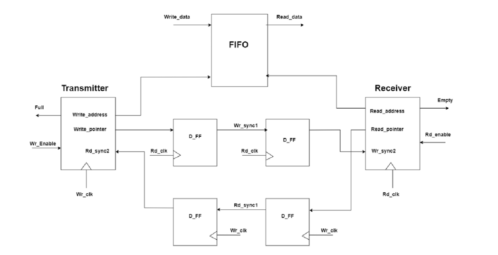

# 16-x-8-Asynchronous-FIFO-

<!DOCTYPE html>
<html lang="en">
<head>
  <meta charset="UTF-8">
  <meta name="viewport" content="width=device-width, initial-scale=1.0">
  <title>16x8 Asynchronous FIFO Design</title>
</head>
<body>
  <h1>16x8 Asynchronous FIFO Design</h1>
  
A 16x8 Asynchronous FIFO (First-In, First-Out) design is a crucial hardware component utilized in digital systems for data buffering and synchronization purposes. It facilitates efficient data transfer between different subsystems by storing and retrieving data in a first-in, first-out manner.

  

  <h2>Key Features:</h2>
  <ul>
    <li><strong>Data Width:</strong> 16 bits input, 8 bits output.</li>
    <li><strong>Asynchronous Operation:</strong> Operates independently of the clock signal, allowing asynchronous data transfer between systems operating at different clock frequencies.</li>
    <li><strong>FIFO Architecture:</strong> Implements a First-In, First-Out data storage mechanism, ensuring data integrity and sequential data retrieval.</li>
    <li><strong>Buffering:</strong> Provides temporary storage for data, allowing for smoother communication between subsystems with varying data rates.</li>
    <li><strong>Control Signals:</strong> Includes control signals such as read, write, empty, and full flags to manage data flow and FIFO status.</li>
    <li><strong>Synchronization:</strong> Ensures proper synchronization between data inputs and outputs, preventing data loss or corruption during transfer.</li>
  </ul>

  
This 16x8 Asynchronous FIFO design plays a vital role in enabling seamless communication between different components of a system-on-chip (SoC), enhancing overall system performance and reliability.

</body>
</html>

